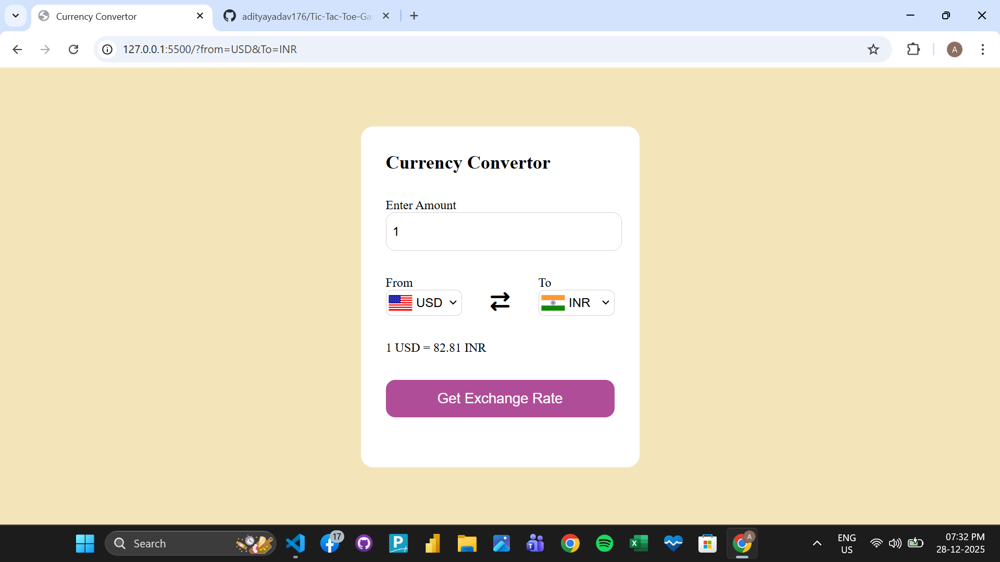

# 💱 Currency Converter Web App

A simple and responsive **Currency Converter** web application built using **HTML, CSS, and JavaScript**.  
It fetches real-time exchange rates using a public currency API and displays country flags dynamically.

---

## 🚀 Features

- 🌍 Convert between multiple currencies
- 🔄 Real-time exchange rates
- 🏳️ Automatic country flag update
- 📱 Responsive design
- ⚡ Fast and lightweight
- 🔗 Uses free public currency API

---

## 🛠️ Technologies Used

- **HTML5**
- **CSS3**
- **JavaScript (ES6)**
- **Fetch API**
- **Currency API**
- **Flags API**

---

## 📸 Preview

> Screenshot or live demo link can be added here

--- 
## 🔗 API Used

**Currency Rates API**

https://2024-03-06.currency-api.pages.dev/v1/currencies


**Flags API**

https://flagsapi.com/%7BCOUNTRY_CODE%7D/flat/64.png


---

## 📂 Project Structure

currency-converter/
│
├── index.html
├── style.css
├── script.js
├── countryList.js
└── README.md


---

## ⚙️ How It Works

1. Select **From** and **To** currencies
2. Enter amount
3. Click **Convert**
4. App fetches exchange rate and displays result
5. Flags update automatically based on currency

---

## ▶️ How to Run Locally

1. Clone the repository:
   ```bash
   

